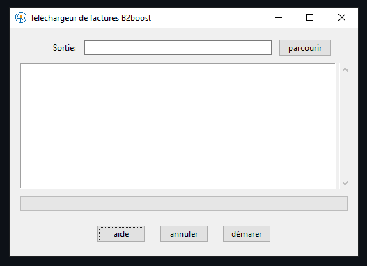
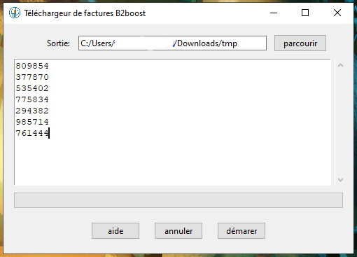
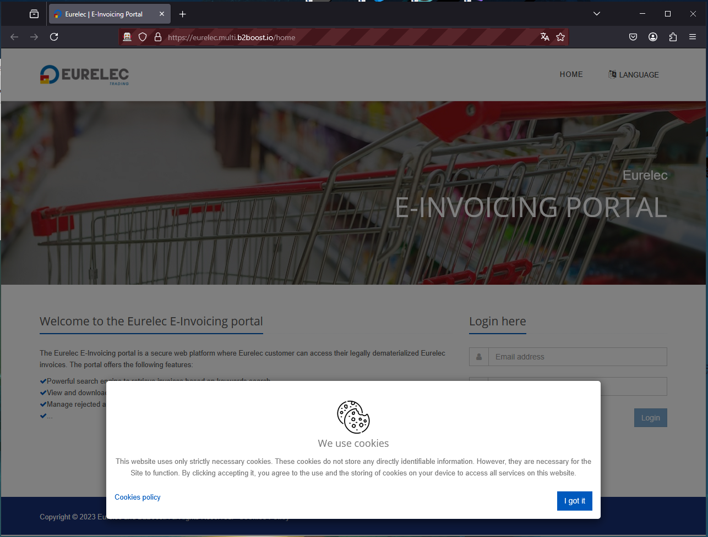

# Page d'aide B2boostFileDownload

Cette page va vous guider dans l'utilisation de l'outil de téléchargement de masse que vous avez entre les mains

## 0. Prérequis
Pour utiliser cet outil, vous devez vous munir de deux choses

- vos identifiants B2boost valides
- La liste des numéros de factures que vous voulez télécharger.

## 1. Lancer le programme
Si vous êtes ici, c'est que c'est potentiellement déjà fait. Si ce n'est pas le cas, lancez le ".exe". Vous devriez maintenant avoir ceci sous les yeux :

## 2. Choisir le dossier de sortie
Vous devez dire au programme où vous souhaitez qu'il mette les fichiers que vous venez de télécharger. Pour cela, vous pouvez soit mettre manuellement le chemin du dossier que vous voulez utiliser dans "sortie" ou cliquer sur "parcourir".

## 3. Enter les numéros de factures
Une fois que c'est fait, il n'y a plus qu'à enter les numéros de factures. Ça ce fait dans la grande boite de texte au centre de la fenêtre.

Il doit y avoir un numéro par ligne, sans virgules ou apostrophes.

**Astuce : vous pouvez copier une sélection depuis Excel sans problèmes**

## 4. Démarrer le programme
Vous devriez avoir quelque chose comme ceci :

Si c'est le cas, cliquez sur démarrer

## 5. Connexion à B2boost
 Après quelques instants, une fenêtre de navigateur va s'ouvrir (ça peut prendre un peu de temps).

 

 Acceptez les cookies en cliquant sur "I got it" et connectez-vous au site.
 
 **/!\ attention : vous avez 5 minutes pour vous connecter. Après ce délai, vous devrez cliquer à nouveau sur démarrer**

 Une fois que vous êtes connecté, le programme prend le relais et va entamer le téléchargement.

 ## 6. Le téléchargement
 Selon la vitesse de votre connexion Internet et le nombre de fichiers demandés, cette opération peut être très longue. Vous pouvez suivre l'avancée grâce à la barre de chargement.
 
 ## 7. Les résultats
 Le programme va s'éteindre tout seul lorsqu'il aura fini. (Il ne faut donc pas s'inquiéter s'il disparait).
 Vous pourrez alors trouver dans le dossier sélectionné plus tôt les factures demandées.

 ## 8. Les erreurs
 En cas d'erreur, soit que la facture n'est pas trouvée ou pour toute autre raison, vous trouverez dans le dossier sélectionné plus tôt "errors.csv".
 
 Ce fichier comprend la liste de toutes les factures durant le téléchargement desquelles une erreur s'est produite. Vous pourrez ainsi en connaitre la raison.